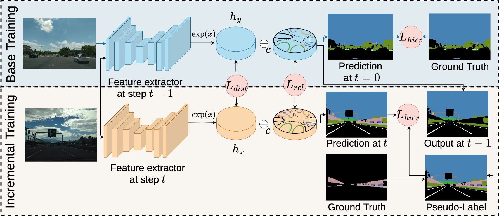

# Taxonomy-Aware Continual Semantic Segmentation in Hyperbolic Spaces for Open-World Perception

This repository contains the PyTorch implementation of the TOPICS model proposed in our RA-L 2025 paper [Taxonomy-Aware Continual Semantic Segmentation in Hyperbolic Spaces for Open-World Perception](https://ieeexplore.ieee.org/document/10816009) and TOPICS+ [
Dynamic Robot-Assisted Surgery with Hierarchical Class-Incremental Semantic Segmentation](https://arxiv.org/abs/2508.01713), an extension to robotic surgery environments.


## Methodology

TOPICS leverages the class taxonomy and implicit relations between prior classes to avoid catastrophic forgetting in incremental learning steps. We first train the model on the base dataset. The class hierarchy is explicitly enforced in the final network layer which is mapped in hyperbolic space. This geometric space ensures that classes are equidistant to each other irrespective of their hierarchy level which facilitates learning tree-like class hierarchy structure. During the incremental steps, we leverage the old model's weights to create pseudo-labels for the background and employ scarcity and relation regularization losses to maintain important relations of old classes while learning the novel classes in a supervised manner. 



TOPICS+ introduces hierarchical pseudo-labeling and integrates the Dice loss in the hierarchical loss function.

## System Requirement and Installation
- Linux (Tested on Ubuntu 20.04)
- Python3 (Tested using Python 3.8)
- Pytorch (Tested using 2.1.0+cu118)
- Install all other python dependencies using [install.sh](./install.sh).

## Code execution

### Data Format

Download the original [Cityscapes](https://www.cityscapes-dataset.com), [Mapillary Vistas datasets](https://www.mapillary.com/dataset/vistas), [MM-OR] (https://github.com/egeozsoy/MM-OR), [Syn-Mediverse](https://syn-mediverse.cs.uni-freiburg.de/) or Endovis18.

### Training 
Download the ImageNet pretrained model from: [link](https://github.com/mapillary/inplace_abn#training-on-imagenet-1k) and save in pretrained/
All Training scripts are provided in [scripts](./scripts). Training scripts with sub-string l2 and l24 refer to baselines whereas model code for TOPICS is executed with l6 and l26 scripts. The training script name corresponds to the [configs](./configs) file. 


When creating new CISS settings, first create a new .csv file in [configs](./configs). Then set "_root" according to your filesystem in [utils/create_filter_file.py](./utils/create_filter_file.py) and execute this file to create the corresponding .npy file for your new setting. 


## License
This code is released under the [GPLv3](https://www.gnu.org/licenses/gpl-3.0.en.html) for academic usage. For commercial usage, please contact [Julia Hindel](https://rl.uni-freiburg.de/people/hindel). If you report results based on the dataset or code, please consider citing the paper. 

```
@article{hindel25topics,
			title={Taxonomy-Aware Continual Semantic Segmentation in Hyperbolic Spaces for Open-World Perception},
			author={Hindel, Julia and Cattaneo, Daniele and Valada, Abhinav},
			journal={IEEE Automation and Robotics Letters (RA-L)},
			volume={10},
			number={2},
			pages={1904-1911},
			year={2025}
		  }

@misc{hindel2025topics+,
      title={Dynamic Robot-Assisted Surgery with Hierarchical Class-Incremental Semantic Segmentation}, 
      author={Julia Hindel and Ema Mekic and Enamundram Naga Karthik and Rohit Mohan and Daniele Cattaneo and Maria Kalweit and Abhinav Valada},
      year={2025},
      eprint={2508.01713},
      archivePrefix={arXiv},
      primaryClass={cs.CV},
      url={https://arxiv.org/abs/2508.01713}, 
}
```


## Acknowledgement
This his work
was partly funded by the Deutsche Forschungsgemeinschaft (DFG, German Research Foundation) – SFB 1597 – 499552394.
